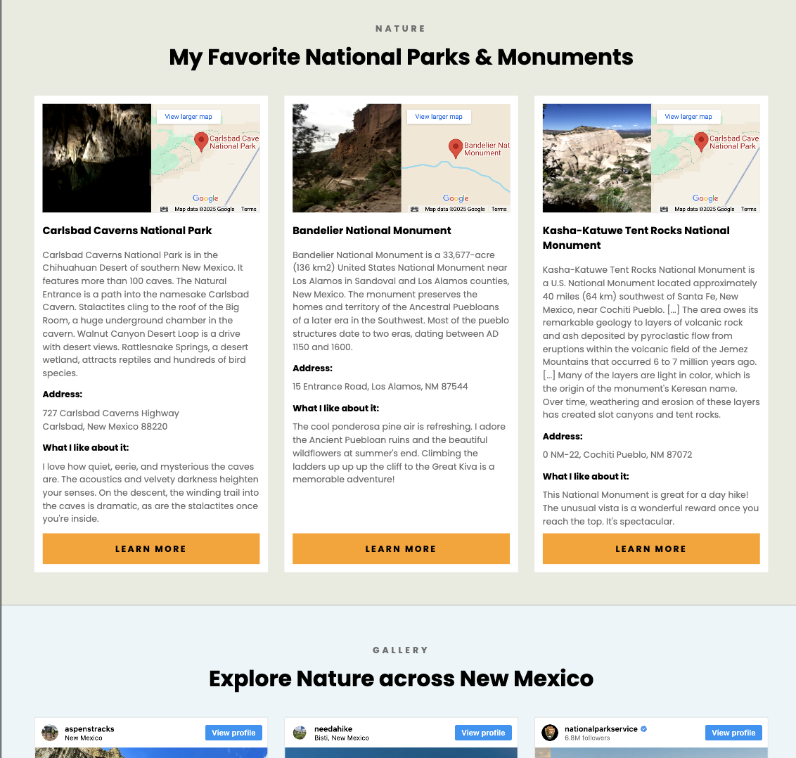

# responsive-travel-project

**_View this project:_** [https://new-mexico-travel-project-al.netlify.app/](https://new-mexico-travel-project-al.netlify.app/)

## Description

A travel website about New Mexico employing advanced responsive web development techniques, plus embedded content from Instagram and Google Maps. It looks good on large screens, tablets, and mobile devices. The site features historical information about New Mexico, cards I created about National Parks and Monuments, a gallery of social media posts, along with a hero at the top and a footer with links at the bottom.

## Coding Features

- **_CSS:_** advanced responsive web design; media queries; CSS Grid techniques; Flexbox; CSS filter function for photos; custom Google Font; background images with legible text overlaid (using linear-gradient technique); responsive resizing of images; substitution of desktop image for mobile image as appropriate; hover, active, and visited link effects

- **_HTML:_** accessible semantic tags, logical ordering, meta description for SEO, alt text for images, titles for anchor links

- Coded in VS Code with tools for a **_professional development workflow, version control, and continuous deployment_**, such as Live Server, Git, GitHub, and hosting on Netlify

## Accessibility Rating

- **_Accessibility rating_** by Lighthouse audit: / for desktops, / for mobile devices.

## Design Spec

This professional design spec inspired the layout of the website. I made improvements where accessibility was not considered by the designer. I also substituted embedded content from Instagram to liven up the photo gallery.

View the design spec on Figma: [https://www.figma.com/design/GR0VkaqiNbRcSvTkWXGAiZ/SheCodes-Workshop-Material?node-id=0-1&p=f](https://www.figma.com/design/GR0VkaqiNbRcSvTkWXGAiZ/SheCodes-Workshop-Material?node-id=0-1&p=f)

## Project Preview

Here is a screenshot from section two of the website, featuring responsive cards in a grid:

### Photo Attributions

- Hero image: Photo by Davron Bowman on Unsplash [https://unsplash.com/photos/the-sun-is-setting-over-the-mountains-in-the-desert-sCM4NNMWGJc](https://unsplash.com/photos/the-sun-is-setting-over-the-mountains-in-the-desert-sCM4NNMWGJc)
- Chaco Canyon image: Photo by Raychel Sanner on Unsplash [https://unsplash.com/photos/brown-brick-wall-with-white-square-frame-sLDoz8ssqtY](https://unsplash.com/photos/brown-brick-wall-with-white-square-frame-sLDoz8ssqtY)
- Footer image: Photo by Wendy Shervington on Unsplash [https://unsplash.com/photos/a-street-with-cars-parked-on-the-side-of-it-YJI-WI4dJEU](https://unsplash.com/photos/a-street-with-cars-parked-on-the-side-of-it-YJI-WI4dJEU)
- Photos of Carlsbad Caverns, Bandelier National Monument, and Kasha-Katuwe Tent Rocks National Monument by Addy López
